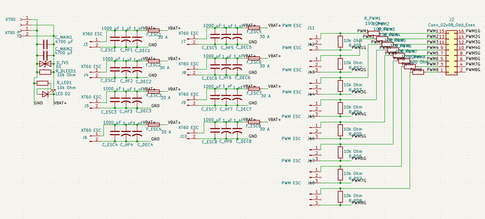

# SwimBladder

Power distribution board (PDB) project files for the SwimBladder project.

> [!WARNING]
> This board is an unvalidated, untested work in progress (WIP).
> It has not completed electrical, thermal, or in-water system validation.
> Do not treat this design as production-ready hardware.

## Project Status

- Current state: WIP (design in progress)
- Validation status: not electrically validated
- Test status: not thermally validated, not full-load validated, not field-tested
- Use at your own risk until formal verification is completed

## Repository Contents

- `KiCad Project Files/` - KiCad project, PCB, and schematic sources.
- `Screenshots/` - Board and schematic screenshots.
- `SwimBladder PDB.kicad_sch` - Top-level schematic file.
- `Swim_Bladder_Doc_v3_0.pdf` - Full engineering reference and calculations.

## Project Overview

This board is designed as a compact 8-thruster central star-node PDB for Blue Robotics T200 systems with 4S battery input.
It is currently in a pre-validation state and should be treated as a reference design draft.

- System topology: battery -> cable-side main fuse -> optional e-stop/contactor -> dual XT90 input -> central high-current node -> 8 fused ESC branches -> XT60 outputs
- Nominal battery voltage: 14.8 V (4S), full charge: 16.8 V
- Thruster design current: about 25 A each
- Total design current: 200 A (with burst targets up to around 280-300 A)
- Per-branch fuse target: 30 A

## Key Engineering Notes (from the PDF)

- Architecture: single compact central +VBAT node, not dual banks, for a roughly 90 mm x 90 mm board.
- Safety: main fuse should be upstream on the battery cable (recommended 225-250 A), close to the battery.
- Copper strategy: use a short, wide, via-stitched central polygon (L1 + L3 for +VBAT), and strong common ground return (L2 + L4).
- Branch geometry: practical branch widths around 12-15 mm (8-10 mm absolute compact minimum for very short sections).
- Connectors: dual XT90 input for current sharing (symmetrical wiring), XT60 per ESC branch preferred.
- Protection/passives: 22-24 V standoff TVS class for 4S input, bulk capacitance near input/node plus branch-level capacitors.
- Signal: 16-pin IDC PWM header with alternating PWM/GND and per-channel series + pulldown resistors.

## Quick Calculation Snapshot

- Per thruster power at 16 V and 25 A: 400 W
- System power for 8 thrusters: 3200 W
- Example central copper section in the doc (50 mm width, 140 um thickness, 25 mm length, one layer):
	- Estimated R ~= 0.0616 mOhm
	- Vdrop at 200 A ~= 0.012 V
	- Copper loss at 200 A ~= 2.46 W

For complete assumptions, formulas, BOM guidance, and test plan, see `Swim_Bladder_Doc_v3_0.pdf`.

## Screenshots

### Schematic

### PCB Layout

### 3D Board View

## Getting Started

1. Install KiCad (recommended version 7+).
2. Open the project from `KiCad Project Files/UWU PDB.kicad_pro`.
3. Review schematic, layout, and engineering assumptions from the PDF before fabrication.

## License

This project is licensed under the MIT License. See the LICENSE file for details.
